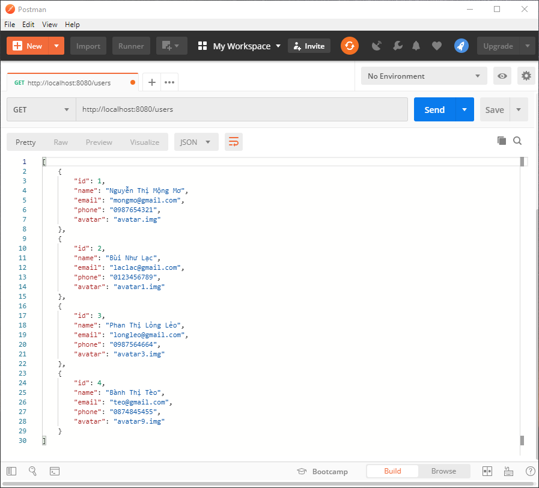
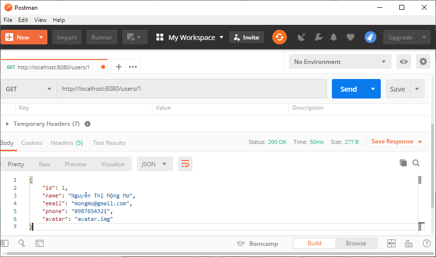

❓ Viết các api cho hệ thống quản lý user

GET /users: Lấy về danh sách user
GET /users/{id}: Lấy thông tin user theo id
POST /users: Tạo mới user
PUT /users/{id}: Sửa thông tin user
DELETE /users/{id}: Xóa user 

Danh sách user được mockup sẵn và lưu vào một mảng động.

Thông tin user gồm có:

* Id: có giá trị duy nhất, dùng để phân biệt giữa các user
* Name
* Email
* Phone
* Avatar
* Password: Mã hóa sử dụng thuật toán Bcrypt

Tạo project mới với nội dung file [pom.xml](pom.xml)

Các API cần viết đều hướng đến đối tượng là user nên chúng ta sẽ gom nhóm tất cả các api vào cùng một controller xử lý. 
Controller chỉ có tác dụng hứng các request và trả về response, phần logic xử lý chúng ta sẽ viết trong service.
Để tiện thì chúng ta sẽ lưu mảng user trong service luôn để tiện truy xuất do tại ví dụ này chưa thực hiện kết nối đến database. 

✏️ Tạo package entity → Tạo class User dùng để lưu trữ thông tin của một user, đánh dấu là @Component: [Entity User](/src/main/java/com/example/demo/entity/User.java)

✏️ Tạo package service → Tạo interface UserService, đánh dấu là @Service: [Service User](/src/main/java/com/example/demo/service/UserService.java)

✏️ Trong package service, tạo class UserServiceImpl implements interface Service, đánh dấu là @Component, chứa mảng động User: [Service User Implements](/src/main/java/com/example/demo/service/UserServiceImpl.java)

✏️ Tạo package controller → Tạo class UserController: [Controller User](/src/main/java/com/example/demo/controller/UserController.java)

👉 Để giảm thiểu sự phụ thuộc giữa tầng Controller và Service, chúng ta sử dụng một dependency thuộc interface UserService thay vì  thuộc class UserServiceImpl trong UserController. 
Đánh dấu @Autowired cho dependency đó → Khi UserController được khởi tạo, Spring Boot sẽ quét trong context tìm Bean thuộc kiểu UserService để inject và UserServiceImpl sẽ được chọn. 
Nên nhớ chúng ta phải đánh dấu UserServiceImpl là @Component. 

❓ Viết api GET /users

💡 Thông thường, cấu trúc dữ liệu response trả về cho client thường khác so với cấu trúc lưu trong database (ít trường hơn hoặc thông tin phức hợp từ nhiều bảng hoặc kiểu dữ liệu của các trường thay đổi theo yêu cầu của frontend)

Thông tin của một user gồm: Id, Name, Phone, Avatar, Email, Password. Tuy nhiên thông tin user trả về cho client không nên chứa trường password → Do vậy chúng ta sẽ tạo một ra một class mới làm cấu trúc response cho api này.

✏️ Tạo package model.dto → Tạo class UserDto: [UserDto](/src/main/java/com/example/demo/model/dto/UserDto.java)

✏️ Tạo package model.mapper → Tạo class UserMapper chứa các method có tác dụng chuyển đổi thông tin giữa object User và object  UserDto  → Mục đích là để tái sử dụng code: [User Mapper](/src/main/java/com/example/demo/model/mapper/UserMapper.java)

✏️ Định nghĩa method getListUser trong interface UserService: [Service User](/src/main/java/com/example/demo/service/UserService.java)

✏️ Override method getListUser trong UserServiceImpl: [Service User Implements](/src/main/java/com/example/demo/service/UserServiceImpl.java)

✏️ Thêm method xử lý request "GET /users" trong UserController: [Controller User](/src/main/java/com/example/demo/controller/UserController.java)

Sử dụng postman để kiểm tra:

❓ Viết api GET /users/{id}

Thông thường khi muốn request một thông tin đối tượng cụ thể nào đó, chúng ta thường sử dụng những request dạng như

GET /users/2: lấy thông tin user có id là 2
GET /products/51: lấy thông tin product có id là 51
...
2 và 51 là những giá trị có thể thay đổi được tùy theo nhu cầu

👉 Để bắt và xử lý được những request như vậy, chúng ta cần định nghĩa các biến trong request URI và sử dụng annotation  `@PathVariable` để binding các tham số của phương thức với những biến này.

    public class UserController {
    @Autowired
    public UserService userService;

    ...

    @GetMapping("/{id}")
    public ResponseEntity<?> getUserById(@PathVariable int id) {
        ...
    }

👉 Trong request URL, mình đã khai báo {id} để định nghĩa một biến id, và với việc sử dụng annotation @PathVariable trong tham số của phương thức, biến trong request URL sẽ được bind với tham số này. Sau đó bạn có thể sử dụng param id để lọc tìm kiếm trong mảng users tìm ra user có id trùng với yêu cầu.

⚠️ Lưu ý:

Request URL có thể chứa nhiều biến → Bao nhiêu biến ứng với bấy nhiêu param trong method
Spring Boot giúp kiểm tra kiểu dữ liệu của biến có khớp với kiểu của param truyền vào method không → Nếu không khớp sẽ tự động báo lỗi
@PathVariable(required=false) → Không bắt buộc phải truyền biến vào url  → param nhận giá trị null
Mặc định tên biến trên URL sẽ trùng với tên param. Sử dụng tên biến khác như sau
    
    @GetMapping("/{id}")
    public ResponseEntity<?> getUserById(@PathVariable("id") int userID) {
    ...
    }

Query parameters là một chuỗi truy vấn được đính kèm trong một URL. Server sẽ nhận các thông tin này để xử lý và trả về một kết quả phù hợp với truy vấn được gửi lên → Thường được sử dụng trong các api lọc hoặc chuyển trang. Trong URL, các truy vấn sẽ bắt đầu từ sau dấu ? , mỗi truy vấn là một cặp {key:value}, các cặp ngăn cách nhau bởi kí tự &.

❓ Viết api lấy ra danh sách các user có tên chứa từ "Mơ" → Request là GET /users/search?name=Mơ

📜 Class UserController

    @RequestMapping("/users")
    @RestController
    public class UserController {
    @Autowired
    public UserService userService;

    ...

    @GetMapping("/search")
    public ResponseEntity<?> searchUser(@RequestParam String name) {
        
    }
    }

👉 Value của annotation định nghĩa HTTP method và URL sẽ không chứa phần query parameters (chỉ chứa phần nằm trước dấu ?). Sử dụng annotation @RequestParam để binding dữ liệu từ query parameter vào tham số của method. Có bao nhiêu query parameter sẽ có bấy nhiêu @RequestParam + tham số. Tương tự như @PathVariable, Spring Boot giúp kiểm tra kiểu dữ liệu của query parameter có khớp với kiểu của tham số truyền vào method không.

📌 Chỉ định giá trị key cho query parameter

Mặc định giá trị key trùng với tên tham số truyền vào method. Để chỉ định giá trị key khác, sử dụng attribute name.

    @GetMapping("/search")
    public ResponseEntity<?> searchUser(@RequestParam(name="name") String userName) {
    
    }

@RequestParam(name="name") ~ @RequestParam(value="name") ~ @RequestParam("name")

📌 Tùy chọn bắt buộc

    @GetMapping("/search")
    public ResponseEntity<?> searchUser(@RequestParam(required=false) String name) {
    
    }
Mặc định, required=true ⇒ GET /users/search báo lỗi, bắt buộc phải truyền query parameter

📌 Xét giá trị mặc định

    @GetMapping("/search")
    public ResponseEntity<?> searchUser(@RequestParam(defaultValue="test") String name) {
    
    }
/users/search?name= ⇒  name = "test"

/users/search?name=Mơ ⇒  name = "Mơ"

Khi xét giá trị mặc định cho query parameter, required=false

📌 Mapping nhiều parameter

    @GetMapping("/search")
    public ResponseEntity<?> searchUser(@RequestParam Map<String,String> allParams) {
    
    }
📌 Mapping nhiều parameter có nhiều giá trị

    @GetMapping("/search")
    public ResponseEntity<?> searchUser(@RequestParam List<String> name) {
    
    }
Xử lý các request GET /users/search?name=Mơ,Hà , GET /users/search?name=Mơ&name=Hà ⇒ name=["Mơ","Hà"]

Video tham khảo: [RestAPi](https://www.youtube.com/watch?v=eDBkDVB2ibU&list=PLlahAO-uyDzIu2skQWjVHaWrhP34KbxDX&index=12)